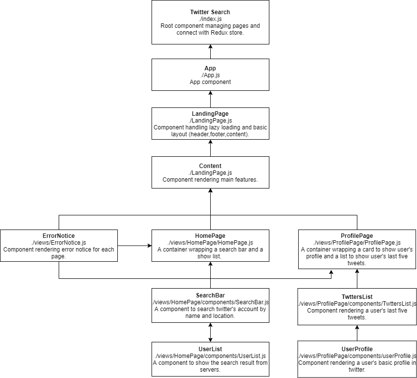
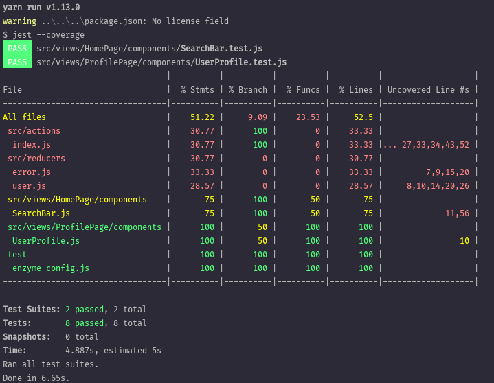
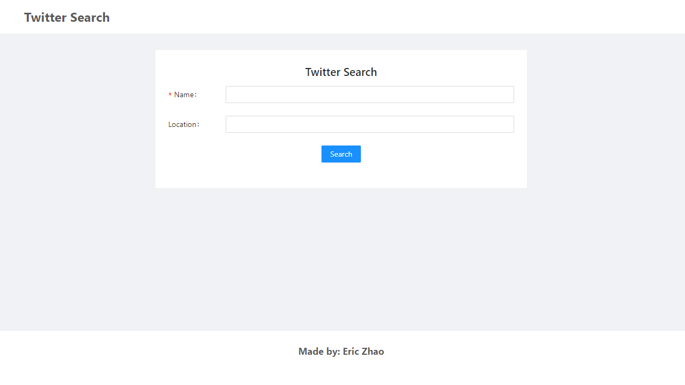
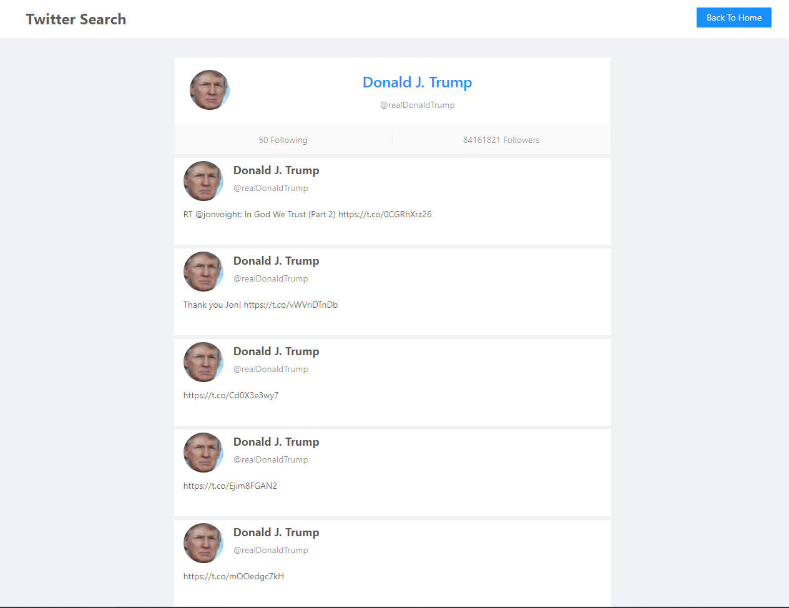

# Code-Test
 This project builds a simple application to search twitter's user account and show some basic information.
 
 
## Project Design

#### Front-end: React+Redux



#### Back-end: Koa+Node.js

- Routers

|  Title   | Endpoint  | Codepath |
|  ----  | ----  | ---- |
|  User Search | /api/users/search | koa-servers/controllers/controller.js|
| User Tweets Search  | /api/tweets/show |koa-servers/controllers/controller.js |

#### Thinking in process
[Notes-Thinking.md](Notes-Thinking.md "Notes-Thinking")

## Installation && Run

### Front-end
````
cd react-web
yarn install / npm install
yarn start  / npm start
````

### Back-end 
````
cd koa-servers
yarn install / npm install
nodemon index.js
````
- Please put .env under koa-servers/

## UNIT TEST

### Front-end
Create some simple unit test for front-end.

````
cd react-web
yarn test
````




## Usage

#### HomePage
You can use search button to search twitter's account by name (mandatory) and location (optional)


#### SearchResult
Here shows the result from twitter's API.


#### UserProfile
Here is the user's profile. You can find how many followers of this account also the last five tweets.

